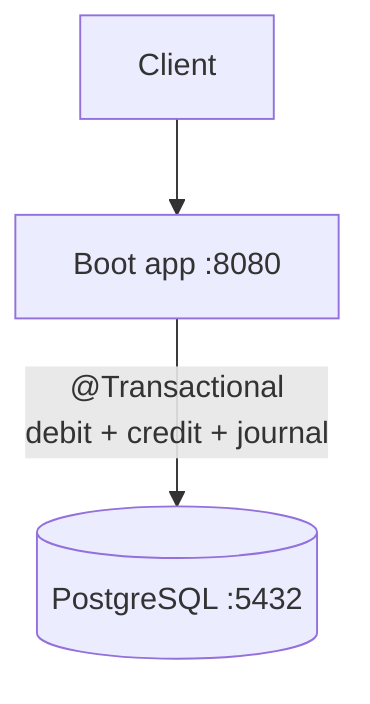

# 1 — Monolith (ACID baseline)

A single Spring Boot service backed by a single PostgreSQL
database. The whole money transfer — debit, credit, and
journal insert — runs inside one local `@Transactional`
boundary, so the database itself guarantees atomicity.

This is the baseline against which the other four modules
are judged: every later architecture has to reproduce
*by hand* what one `BEGIN`/`COMMIT` gives us here for free.

## What's inside

```
1-monolith/
├── compose.yaml            # PostgreSQL + the Boot app
├── Dockerfile              # Multi-stage build with a slim jlink JRE
├── pom.xml                 # Spring Boot 4.0.5, JDBC, validation
└── src/main/
    ├── java/io/temporal/demos/durablemoney/monolith/
    │   ├── account/        # AccountController, AccountService, AccountRepository
    │   └── transfer/       # TransferController, TransferService, TransferRepository
    └── resources/
        ├── application.yaml
        ├── schema.sql      # accounts + transfers tables
        └── data.sql        # seed Alice (1000.00) and Bob (100.00)
```

A single Spring Boot app exposes both the account API and
the transfer API on port `8080`. PostgreSQL listens on
`5432` with database `moneydb` and user `demo`/`demo`.

## Pedagogical goals

- Establish the *correctness* bar: a transfer either fully
  happens or fully does not, with no money lost or created.
- Show how trivial that bar is when one `@Transactional`
  method covers debit + credit + journal insert.
- Highlight the single critical section: a pessimistic
  `SELECT … FOR UPDATE` on the account row, followed by a
  balance check, followed by an `UPDATE` — all serialized
  by PostgreSQL on the row.
- Set up the *contrast* with modules 2-5: as soon as debit
  and credit live in different processes (or different
  databases), this single transaction disappears and the
  application code has to recreate atomicity by other means.

## Architecture



`TransferService.executeTransfer` is annotated
`@Transactional`. If `AccountService.debit` throws
`InsufficientFundsException`, Spring rolls the entire
transaction back automatically — no compensation logic,
no journal row, nothing to clean up.

## Build and run

### With Docker Compose (one command)

```bash
cd 1-monolith
docker compose up --build
```

This starts PostgreSQL and the Boot app, applies
`schema.sql`/`data.sql`, and exposes the API on
`http://localhost:8080`.

### Local Maven build

```bash
cd 1-monolith
mvn package -DskipTests
java -jar target/durable-money-monolith-0.0.1-SNAPSHOT.jar
```

You will need a local PostgreSQL on `localhost:5432`
matching `moneydb` / `demo` / `demo`, or override
`DB_HOST`, `DB_USER`, `DB_PASS` via environment variables.

## API

| Method | Path                  | Purpose                                |
| ------ | --------------------- | -------------------------------------- |
| POST   | `/accounts`           | Create an account                      |
| GET    | `/accounts`           | List all accounts                      |
| GET    | `/accounts/{id}`      | Get one account                        |
| POST   | `/transfers`          | Execute a transfer (synchronous, ACID) |
| GET    | `/transfers/{id}`     | Read a completed transfer              |

`POST /transfers` is synchronous and returns the full
`Transfer` view (id, accounts, amount, `createdAt`,
`completedAt`).

```bash
# Transfer 200.00 from Alice to Bob (seeded accounts)
curl -s -X POST http://localhost:8080/transfers \
  -H "Content-Type: application/json" \
  -d '{
    "sourceAccountId": "91a12083-e27d-48b8-b67a-b28a8207db8d",
    "targetAccountId": "d2ff0ba8-79c4-4ea7-b297-26847d553d63",
    "amount": 200.00
  }' | jq .
```

## Failure modes and limitations

The application code is small and provably correct, but
the *architecture* has well-known limits — these are
exactly what the next modules expose.

- **Single point of failure.** One process and one
  database. If either is down, the API is down.
- **Vertical scaling only.** Reads and writes share the
  same database; no way to scale account reads
  independently from transfer writes.
- **Tight coupling.** Account and transfer logic are
  compiled and deployed together. A change to either side
  re-deploys the whole app.
- **Holds locks for the duration of the transaction.**
  Debit and credit each take a row-level lock with
  `SELECT … FOR UPDATE`. Concurrent transfers touching
  the same account serialize on these locks.

These limits are the motivation for module 2. As soon as
we split the monolith into account-service and
transfer-service over REST, the `@Transactional` boundary
disappears — and money starts disappearing with it.
