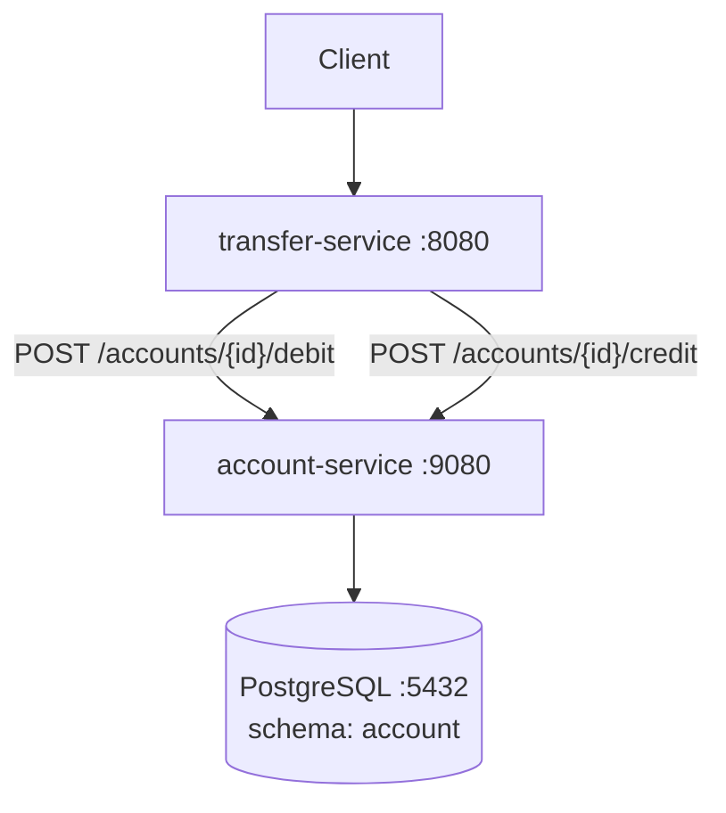

# 2 — Microservices (no safety net)

The monolith of module 1, split into two REST services
sharing a PostgreSQL instance. The transfer logic now
spans two HTTP calls — and there is **no distributed
transaction** to roll them back if one half succeeds and
the other fails.

This module exists to make the failure mode visceral
before any of the later modules try to fix it: when the
credit fails after the debit succeeds, money is silently
lost.

## What's inside

```
2-microservices/
├── compose.yaml              # PostgreSQL + the two services
├── init-db/init.sql          # Creates "account" and "transfer" schemas
├── account-service/          # Owns the accounts table, port 9080
│   ├── Dockerfile
│   ├── pom.xml
│   └── src/main/
│       ├── java/.../account/    # AccountController, AccountService, Repository
│       └── resources/
│           ├── application.yaml
│           ├── schema.sql       # accounts table in schema "account"
│           └── data.sql         # seed Alice + Bob
└── transfer-service/         # Stateless coordinator, port 8080
    ├── Dockerfile
    ├── pom.xml
    └── src/main/
        ├── java/.../transfer/   # TransferController, TransferService, AccountClient
        └── resources/application.yaml
```

`account-service` owns the `accounts` table inside the
`account` schema and exposes synchronous `POST
/accounts/{id}/debit` and `POST /accounts/{id}/credit`
endpoints. `transfer-service` is stateless: it only
forwards REST calls to the account service.

## Pedagogical goals

- Show what happens when a transactional boundary is
  *broken* by a network hop.
- Demonstrate the fundamental failure mode: debit
  succeeds, then `credit` fails (timeout, 5xx, network
  partition) — money disappears.
- Make explicit why this isn't a bug in the code but a
  property of the architecture: there is no shared
  transaction the application could roll back.
- Set up the conversation about what *could* fix this:
  hand-rolled 2PC (module 3), asynchronous messaging with
  retries and a DLQ (module 4), durable execution with
  Sagas (module 5).

## Architecture



`TransferService.executeTransfer` is **not**
`@Transactional`. It calls debit and credit through a
plain `RestClient`. A failure between the two calls
leaves the system in a non-atomic state.

## Build and run

### With Docker Compose

```bash
cd 2-microservices
docker compose up --build
```

PostgreSQL starts on `5432`, account-service on `9080`,
transfer-service on `8080`. The accounts table is created
in the `account` schema (driven by Spring Boot's
`schema.sql` / `data.sql` initialization on the
account-service side; `transfer-service` is stateless).

### Local Maven build

Each service is its own Maven project. Build them
separately:

```bash
cd 2-microservices/account-service
mvn package -DskipTests
java -jar target/*.jar

# In another terminal
cd 2-microservices/transfer-service
mvn package -DskipTests
ACCOUNT_SERVICE_URL=http://localhost:9080 \
  java -jar target/*.jar
```

You can also build everything from the repository root
with the project's `Taskfile.yml`:

```bash
task build
```

## API

`transfer-service` (port `8080`):

| Method | Path                | Behavior                                  |
| ------ | ------------------- | ----------------------------------------- |
| POST   | `/transfers`        | Synchronous; returns `200` with `{transferId, status, message}` |

`account-service` (port `9080`):

| Method | Path                       | Behavior                       |
| ------ | -------------------------- | ------------------------------ |
| POST   | `/accounts`                | Create an account              |
| GET    | `/accounts`                | List all accounts              |
| GET    | `/accounts/{id}`           | Get one account                |
| POST   | `/accounts/{id}/debit`     | Debit an account               |
| POST   | `/accounts/{id}/credit`    | Credit an account              |

```bash
# Trigger a transfer through the transfer-service
curl -s -X POST http://localhost:8080/transfers \
  -H "Content-Type: application/json" \
  -d '{
    "sourceAccountId": "91a12083-e27d-48b8-b67a-b28a8207db8d",
    "targetAccountId": "d2ff0ba8-79c4-4ea7-b297-26847d553d63",
    "amount": 200.00
  }' | jq .
```

## Failure modes and limitations

This module is **deliberately broken** to motivate the
following ones. The interesting failure modes are:

- **Money lost on credit failure.** If `debit` succeeds
  and `credit` then returns 5xx (or times out), the
  source account is debited but the target is not
  credited. There is no compensation, no retry, no
  rollback. The lost amount is gone from the system's
  invariant `sum(balance)`.
- **No distributed transaction.** `transfer-service` does
  not even own a database, so there is no shared
  `@Transactional` to roll back. JTA/XA over PostgreSQL
  via REST is not built in.
- **No retry, no idempotency.** A retried debit would
  double-debit. The endpoint is not idempotent.
- **No durable record of the transfer.** The
  transfer-service is stateless; nothing is journaled.
  You cannot ask "what was the outcome of transfer X?"
  after the response is lost.
- **Non-atomic across services on partial failures**
  even with a successful HTTP 200: a network blip during
  the response of `debit` can leave the source debited
  while the client believes it failed.

Modules 3 (2PC), 4 (messaging + DLQ) and 5 (Temporal
Saga) each address some subset of these problems — and
make the trade-offs explicit.
