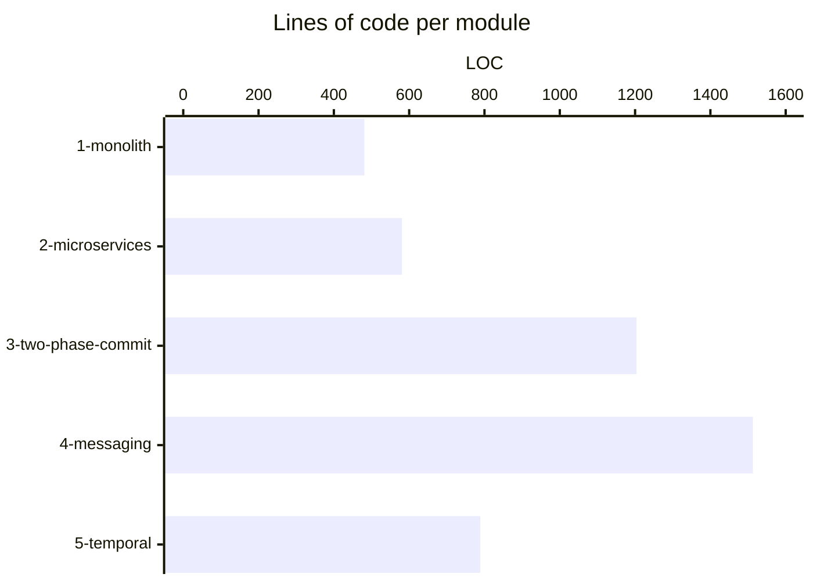

# Durable Money

A hands-on tutorial comparing five approaches to building
resilient money transfer systems — from a classic monolith
to durable execution with Temporal. Designed for developers
who want to understand *why* distributed transactions are
hard and *how* Temporal solves the problem.

[](LICENSE) [](https://github.com/alexandreroman/durable-money/actions/workflows/build.yml)

## Features

- **Progressive complexity** — each module builds on the
  previous one, introducing a new failure mode and its
  solution.
- **Same domain, five architectures** — money transfer is
  implemented identically in all five modules so the
  differences are easy to spot.
- **Runnable with one command** — every module ships with
  a `compose.yaml` that starts all required services.
- **Teaching comments** — key trade-offs are highlighted
  inline in the source code.
- **Modern stack** — Spring Boot 4.0.5, Java 25, PostgreSQL
  17, RabbitMQ 4, Temporal.

## Prerequisites

- Docker and Docker Compose (or Podman + podman-compose)
- Java 25 and Maven (for local development only)

## Modules

Each module is fully independent — no shared code, no
parent POM. Pick one, navigate into its directory, and
run `docker compose up --build`. Each module has its own
README with architecture, build instructions, API
reference, and the failure modes it does (or does not)
handle.

| Module                                       | Approach                   | Key concept                               |
| -------------------------------------------- | -------------------------- | ----------------------------------------- |
| [`1-monolith`](1-monolith/README.md)         | Monolith + ACID            | Single `@Transactional` covers everything |
| [`2-microservices`](2-microservices/README.md) | REST microservices       | Distributed calls without a safety net    |
| [`3-two-phase-commit`](3-two-phase-commit/README.md) | 2PC + Postgres prepared tx | Hand-rolled 2-phase commit, no JTA |
| [`4-messaging`](4-messaging/README.md)       | RabbitMQ + DLQ             | Async resilience, still no compensation   |
| [`5-temporal`](5-temporal/README.md)         | Temporal + Saga            | Durable execution with auto-compensation  |

## Getting started

Clone the repo and start any module:

```bash
git clone <repo-url>
cd durable-money/1-monolith
docker compose up --build
```

The transfer API is available at `http://localhost:8080`
in every module — same request shape, different
guarantees on the response.

## Common conventions

The five modules share a domain and the bare minimum of
contracts so that the *only* thing that changes across
them is the architecture. Anything module-specific lives
in that module's README.

### Seeded accounts

All modules ship the same `data.sql`, so the same two
accounts exist on startup and the same source/target IDs
work everywhere:

| Owner | Account ID                             | Initial balance |
| ----- | -------------------------------------- | --------------- |
| Alice | `91a12083-e27d-48b8-b67a-b28a8207db8d` | 1000.00         |
| Bob   | `d2ff0ba8-79c4-4ea7-b297-26847d553d63` | 100.00          |

```bash
# Transfer 200.00 from Alice to Bob — same body in every module
curl -s -X POST http://localhost:8080/transfers \
  -H "Content-Type: application/json" \
  -d '{
    "sourceAccountId": "91a12083-e27d-48b8-b67a-b28a8207db8d",
    "targetAccountId": "d2ff0ba8-79c4-4ea7-b297-26847d553d63",
    "amount": 200.00
  }' | jq .
```

### Transfer response shape across modules

`POST /transfers` accepts the same body everywhere, but
the response evolves as the architecture moves from
synchronous-atomic to asynchronous-durable:

| Module             | Status       | Response body                                                                              |
| ------------------ | ------------ | ------------------------------------------------------------------------------------------ |
| 1-monolith         | 202 Accepted | full Transfer (`id`, accounts, `amount`, `createdAt`, `completedAt`) — synchronous, atomic |
| 2-microservices    | 200 OK       | `{transferId, status, message}` — synchronous, may leave money lost on failure             |
| 3-two-phase-commit | 200 OK       | full Transfer (atomic via 2PC) — synchronous, all-or-nothing across services               |
| 4-messaging        | 202 Accepted | `{id, status, message, createdAt, updatedAt}` — async, poll `GET /transfers/{id}`          |
| 5-temporal         | 202 Accepted | `{transferId}` — async via Temporal; observe in the UI or `GET /transfers/{workflowId}`    |

### Configuration env vars

Each module reads its configuration from environment
variables. The defaults are good for local development;
override them for non-Docker runs. Module-specific
variables (RabbitMQ, Temporal, …) are documented in the
relevant module's README.

| Variable              | Description                          | Default                 |
| --------------------- | ------------------------------------ | ----------------------- |
| `DB_HOST`             | PostgreSQL hostname                  | `localhost`             |
| `DB_USER`             | PostgreSQL username                  | `demo`                  |
| `DB_PASS`             | PostgreSQL password                  | `demo`                  |
| `ACCOUNT_SERVICE_URL` | Account service base URL (modules 2, 3, 5) | `http://localhost:9080` |
| `RABBITMQ_HOST`       | RabbitMQ hostname (module 4)         | `localhost`             |
| `TEMPORAL_ADDRESS`    | Temporal Server address (module 5)   | `localhost:7233`        |

### Building from source

Build every Maven module from the repo root with [Task](https://taskfile.dev):

```bash
task build       # mvn -B package -DskipTests for every module
task test        # mvn -B test for every module
task clean       # mvn -B clean for every module
```

Or build a single module on its own:

```bash
cd <module>
mvn package -DskipTests
```

## Lines of code

The same money-transfer use case is implemented in every
module, so the size of each codebase is a fair proxy for
its underlying complexity. The numbers below count Java
sources and configuration files (`pom.xml`, `compose.yaml`,
`application.yaml`, `schema.sql`, `Dockerfile`, etc.),
excluding comments and blank lines.

The `Q` column rates each implementation's behavior under
failure: ✅ no money lost, 🟡 correct but with significant
operational caveats, ❌ money silently lost.

| Module               |  LOC |  Q  | Notes                                    |
| -------------------- | ---: | :-: | ---------------------------------------- |
| `1-monolith`         |  481 |  ✅  | Atomic via @Transactional; monolithic    |
| `2-microservices`    |  581 |  ❌  | Incomplete: money lost if credit fails   |
| `3-two-phase-commit` | 1204 |  🟡  | Atomic + recovery loop; still synchronous and chatty |
| `4-messaging`        | 1513 |  🟡  | Async + managed DLQ; no auto-compensation |
| `5-temporal`         |  789 |  ✅  | Durable & resilient; no money lost       |



A few takeaways:

- The monolith is the baseline — one service, one database,
  one `@Transactional` boundary.
- Module 3 is roughly 2.5× the monolith: hand-rolling 2PC
  over PostgreSQL prepared transactions has a real cost in
  coordinator, journaling, **and crash-recovery** code.
- Module 4 grows past module 3 once the DLQ is fully
  managed: draining each DLQ into Postgres, exposing
  `/admin/dlq` for inspect / replay / discard, and the
  consumer-side idempotency that makes replay safe all
  add real lines. Async messaging avoids the 2PC
  coordinator, but the "parking lot" is operational code
  someone has to write and maintain.
- Module 5 is durable and resilient by design *with* fewer
  lines than module 4: Temporal persists workflow state,
  retries activities, and drives Saga compensation — the
  bookkeeping that DLQ-based recovery requires lives in
  the SDK, not in application code.

## License

This project is licensed under the Apache-2.0 License —
see [LICENSE](LICENSE) for details.
